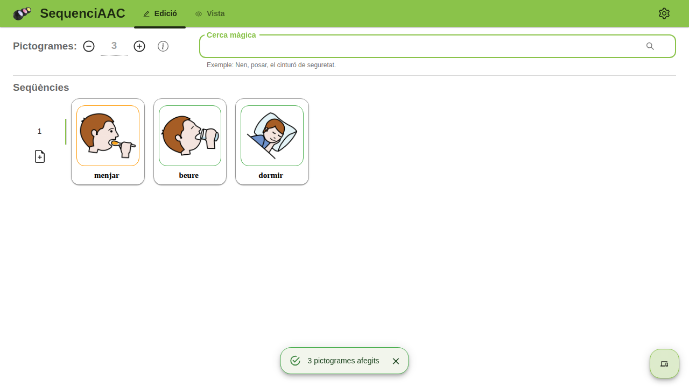
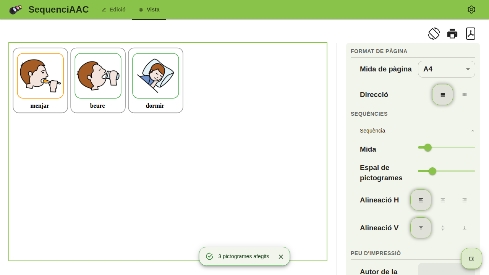

<div align="center">


# SequenciAAC

**Crea, personalitza i imprimeix seqüències de pictogrames [ARASAAC](https://www.arasaac.org).**

Una eina per a mestres, logopedes, terapeutes i famílies que treballen amb
comunicació augmentativa i alternativa (CAA): munta la seqüència, ajusta com es
veu i emporta-te-la en paper o en PDF.

<br />

[](https://react.dev)
[](https://www.typescriptlang.org)
[](https://mui.com)
[](https://redux-toolkit.js.org)
[](https://expressjs.com)
[](https://www.mongodb.com)
[](https://nodejs.org)
[](https://turbo.build)

</div>

---

## Què és

L'app té dues pàgines de treball i es passa d'una a l'altra sense perdre res:

| Edició — `/create-sequence` | Visualització — `/view-sequence` |
|---|---|
|  |  |
| S'hi construeix la seqüència: cerca de pictogrames, ordre, text, marcs i colors. | S'hi previsualitza el full: mida dels pictogrames, separació, alineació, direcció i format de pàgina. |

**Funciona sencer sense compte.** La configuració i les seqüències es guarden al
navegador. El compte és opcional i només afegeix núvol: desar seqüències,
sincronitzar la configuració entre dispositius i tenir vocabulari personal.

## Funcionalitats

- 🔍 **Cerca de pictogrames d'ARASAAC** en 37 idiomes de cerca, amb paraules clau.
- 🎨 **Personalització del full** — mida i espaiat dels pictogrames, alineació,
  direcció (files o columnes), marcs interiors i exteriors, tipografia, color del
  text i font dels números.
- 🖨️ **Impressió i PDF** en A4, A3 o a pantalla completa, amb orientació vertical
  o apaïsada. La sortida sempre és en clar, encara que l'app estigui en tema fosc.
- 🖥️ **Mode pantalla completa** per treballar la seqüència directament a la pantalla.
- 🗂️ **Diverses seqüències** dins d'un mateix document.
- 🌍 **Interfície multiidioma**: català, castellà, anglès, francès i italià.
- 🌗 **Tema clar i fosc**, amb una paleta única i contrast verificat (WCAG AA).
- 💾 **Esborrany automàtic al navegador** — el que hi ha a pantalla es recupera
  encara que es tanqui la pestanya.
- ☁️ **Amb compte** (opcional): seqüències desades al núvol, configuració
  sincronitzada i vocabulari personal amb imatges pròpies.

## Tecnologia

**Monorepo** amb npm workspaces + [Turborepo](https://turbo.build).

| Peça | Stack |
|---|---|
| `apps/web` — front | React 18 · TypeScript · Vite (SWC) · Redux Toolkit · React Router v6 · MUI + Emotion · react-intl · Playwright |
| `apps/api` — back | Express · TypeScript (`tsx`) · MongoDB + Mongoose · Zod · JWT (access + refresh en cookie `httpOnly`) · Cloudinary · Resend · Vitest |
| `packages/shared-types` | Tipus de domini compartits pel front i el back, perquè el contracte de l'API i el model de Redux no divergeixin |

Front desplegat a **Vercel**, back a **Render** (`render.yaml`).

## Estructura

```
apps/
├── web/
│   ├── languages/          # Traduccions FONT (ca, es, en, fr, it) — s'editen aquí
│   ├── e2e/                # Tests Playwright (captures i vídeos de funcionalitats)
│   └── src/
│       ├── pages/          # WelcomePage, EditSequencesPage, ViewSequencePage, AdminPage…
│       ├── components/     # Components reutilitzables (SettingsLayout, AppTabs, PictogramCard…)
│       ├── Modals/         # DefaultSettingsModal, PictEditModal…
│       ├── features/       # backend/ · sequence/ · user-settings/ · print/ · pictogram/
│       │                   # word-profile/ · admin/
│       ├── app/            # Store de Redux
│       └── style/          # palette.ts i themeMui.ts (única font de veritat de colors)
├── api/
│   └── src/
│       ├── modules/        # auth · documents · user-settings · client-errors · admin · security
│       ├── middleware/     # auth, requireAdmin, requireVerifiedEmail, errorHandler
│       └── config/         # env.ts (validació amb zod), database.ts
└── packages/shared-types/
```

## Posada en marxa

**Requisits:** Node **22.x** (hi ha `.nvmrc`) i npm 10.

```bash
git clone https://github.com/rtrepis/sequence-arasaac.git
cd sequence-arasaac
npm install
```

### Només el front

Prou per treballar en tota la part d'edició, vista, impressió i PDF: no cal ni
base de dades ni servidor.

```bash
npx turbo dev --filter=web      # http://localhost:5173
```

Variables (`apps/web/.env`):

| Variable | Per a què serveix |
|---|---|
| `VITE_APP_API_ARASAAC_URL` | Base de l'API pública d'ARASAAC |
| `VITE_API_URL` | Base de l'API pròpia (només si es fa servir el compte) |
| `VITE_GOOGLE_ANALYTICS_ID` | Analítica — opcional |

### El back

Cal un `apps/api/.env`. `src/config/env.ts` el valida amb Zod i atura el procés
amb un missatge clar si en falta cap:

| Variable | Notes |
|---|---|
| `MONGODB_URI` | Connexió a MongoDB |
| `JWT_SECRET`, `JWT_REFRESH_SECRET` | Signatura dels tokens |
| `CORS_ORIGIN` | Origen del front (per defecte `http://localhost:5173`) |
| `CLOUDINARY_CLOUD_NAME`, `CLOUDINARY_API_KEY`, `CLOUDINARY_API_SECRET` | Imatges del vocabulari personal. El *cloud name* és només el nom, no la URL `cloudinary://…` |
| `IP_HASH_SECRET`, `RESEND_API_KEY` | Opcionals en desenvolupament, **obligatoris** en producció |
| `MAIL_FROM`, `APP_PUBLIC_URL`, `ADMIN_ALERT_EMAIL` | Correu de verificació i avisos d'error |

```bash
npx turbo dev --filter=api      # http://localhost:3000
```

## Ordres

Les ordres de l'arrel les reparteix Turbo a tots els workspaces; amb
`npx turbo <ordre> --filter=web` (o `--filter=api`) s'acoten a un de sol.

| Ordre | Què fa |
|---|---|
| `npm run dev` | Front i back en mode desenvolupament |
| `npm run build` | Compila tots els workspaces |
| `npm run typecheck` | `tsc --noEmit` — **l'única barrera de tipus del projecte** |
| `npm run lint` | ESLint al front, `tsc --noEmit` al back |
| `npm test` | Vitest a l’API (al web encara és un placeholder) |
| `npx playwright test` (dins `apps/web`) | Tests e2e |

> [!IMPORTANT]
> `vite build` **no** comprova tipus: `@vitejs/plugin-react-swc` els llença sense
> mirar-los. Un `✓ built` verd no vol dir que el TypeScript quadri — la
> comprovació que compta és `npm run typecheck`.

### Traduccions

Els textos s'editen a `apps/web/languages/*.json` (font) i es compilen a
`apps/web/src/languages/*.json` (generats — **mai editar-los a mà**).

## Documentació

`CLAUDE.md` és l'índex del projecte. Els estàndards viuen a `docs/estandards/` i
es llegeixen quan es toca l'àrea corresponent:

| Document | Llegir-lo abans de tocar |
|---|---|
| [`colors.md`](docs/estandards/colors.md) | Colors, fons, tema fosc, impressió i PDF |
| [`configuracions.md`](docs/estandards/configuracions.md) | Panells d'ajustos |
| [`navegacio.md`](docs/estandards/navegacio.md) | Tabs, barra de navegació, avatar |
| [`capes-flotants.md`](docs/estandards/capes-flotants.md) | Diàlegs, snackbars, botons flotants |
| [`feedback-i-accions.md`](docs/estandards/feedback-i-accions.md) | Progrés, backdrops, accions destructives |
| [`estat-i-persistencia.md`](docs/estandards/estat-i-persistencia.md) | Redux, esborrany, imatges, tipografia |
| [`backend.md`](docs/estandards/backend.md) | `features/backend/*` i mòduls de l'API |
| [`comptes-i-quotes.md`](docs/estandards/comptes-i-quotes.md) | Autenticació, quotes, administració, desplegament |
| [`correus.md`](docs/estandards/correus.md) | Plantilles i enviament de correu |

I els estudis de fons: [`BACKLOG-ux.md`](docs/BACKLOG-ux.md) (troballes d'UX
obertes), [`ESTUDI-limits-serveis-gratuits.md`](docs/ESTUDI-limits-serveis-gratuits.md)
(què consumeix l'app de cada pla gratuït) i
[`ESTANDARD-capes-flotants.md`](docs/ESTANDARD-capes-flotants.md).

## Crèdits i llicència

Els pictogrames són propietat del **Govern d'Aragó** i s'han creat per
**Sergio Palao** per a [ARASAAC](https://www.arasaac.org), que els distribueix
sota llicència **[CC BY-NC-SA](https://www.arasaac.org/terms-of-use)**.

Els problemes i les propostes van a
[Issues](https://github.com/rtrepis/sequence-arasaac/issues/new).
